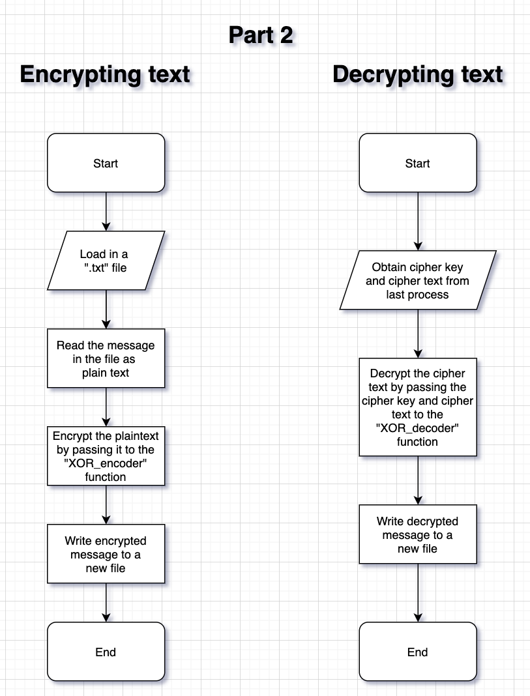
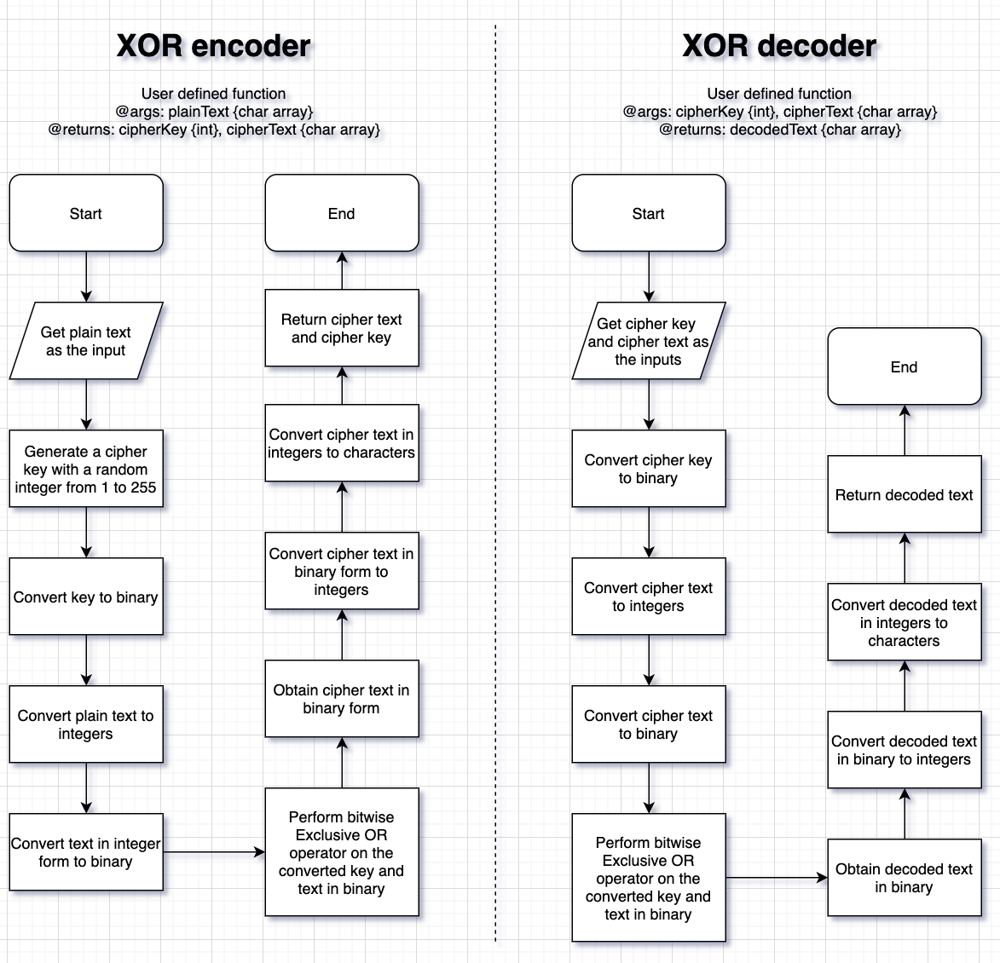

# MATLAB Ciphers (XOR Encoder/Decoder)

### Table of Contents
* [Project Description](#description)
* [Connect](#connect)

# Project Description
* A cipher program written in MATLAB to encrypt and decrypt a text message based on the Exclusive OR operator
* Lab 2 project for OENG1207 – Digital Fundaments
* Full project report can be found in docs folder

**Program flow:**

**Algorithm design:**

## Connect with me
* My [Facebook](https://www.facebook.com/Hoangdayo/)
* My [Instagram](https://www.instagram.com/hoang.desu/)
* You can shoot me an [email](mailto:hoangdesu@gmail.com) too

If you find this project useful, you can let me know. I would love to hear about it!

